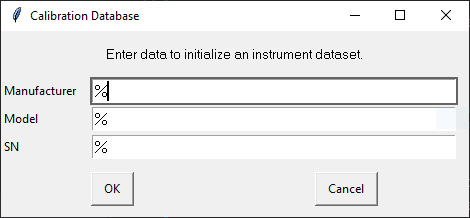

# Demonstration of a Python Calibration Application

This software package enables calibration of a Fluke175 multimeter with a Fluke 5500 calibrator. For each electrical function a measurement model is implemented. Based on this model and the uncertainties coded into the Fluke 5500 device driver uncertainties of the measurands are calculated. With this software also a well structured certificate can be created.

It is python software provided as a package which is installed using pip. This method ensures that also the dependencies are installed correctly. This software is mainly based on source code which was developped when starting our calibration business. The core concepts where implemented within around 3 month in 2012/13 and is used up to now for our calibration service.
At that time I switched programming language to Python because I wanted a flexible system to support lab operation. Therefore the code is often not already Pythonic and formatting is not PEP8 compliant.

# Installation

Download the file _smt-cal-demo-1.0.1.tar.gz_ which you find in folder _dist_.
To use this application a python >=3.8 environment on a Windows 10 machine is required. We suggest to install the software package in an own virtual environment to avoid any negative influence on existing software. The package name is smt_cal_demo.
Create a virtual environment at a convenient place with read/write and executing rights. In this recipe we use C:\smt_cal_demo. Open a windows command-line (cmd.exe)
```
py -m venv c:\smt_cal_demo
```
This takes a few seconds. Then change to the directory where the virtual environment is
```
c:
cd \smt_cal_demo
Scripts\activate
```

Now the virtual environment is activated und pip can be used to install the tar file. Because some external packages are used an internet connection is required.
```
pip install Path_to_download\smt-cal-demo-1.0.1.tar.gz
```
This also takes some time, because some packages have to be downloaded from internet and installed.

# Usage

## Creating a certificate

The database is already initialized to enable creation of a certificate without any measurements.
Open a command line. Change into the directory of the above virtual environment and activate it:
```
c:
cd \smt_cal_demo
Scripts\activate
```
Now enter::
```
cert
```
A dialog appears



It would normally enable to select the right device effectivly. If you have not added other devices you can just press enter.

A second dialogue appears which enables you to select the calibration. For the first time operation only one calibration is stored and therefore the dialog look as follows:


Just select Yes.

To create the report the program needs the test specification. It will be in the site-packages of the virtual python environment as you could see here.


Select fluke175.py

The next dialog requests some more information which will be part of the report


Just press Ok. The program will then process data and create a report. The location depends on the virtual environment. 


## Calibration

### Setup communication to Fluke 5500A

Communication is done using module __smt_cal_demo/calibration/devices/serial_devices_manager_v01.py__.
We assume that the calibrator is connected by serial interface (9600Baud, odd Parity, Seven Bits)
The COM port to the Fluke 5500 must be set in the module in line 21.
This scripts communicates by ZeroMQ (Port 5001) with the device driver and the calibration sequencer.

#### Calibrating a Fluke 175

Open a command line. Change into the directory of the above virtual environment and activate it:
```
c:
cd \smt_cal_demo
Scripts\activate
```
Now enter::
```
start /B serial
```
This starts the communication program. It will be active until the process (cmd-Window) ist terminated

Now enter:
```
gui
```
A QT based UI opens.
The start and general usage of this GUI shows the following animated gif.


From the file menu load the file __py3/calibration/calibration_sequences/fluke/fluke175.py__
which is located in the site-package of the virtual python environment.


Click on >>Select Instrument<< and select the Dummy device. Than click on >>Select Calibration<<. Click on >>New<<. Enter project number. This can be any string which identifies the project. This number will later appear on the certificate.
Select operator. Click now on >>Start Measurement<<.
Follow the instruction and wire DUT and calibrator accordingly. We assume you are experienced in calibrating such devices. High voltage might be present unexpectedly. Never touch conductors directly. This software does not fullfill safety requirements.